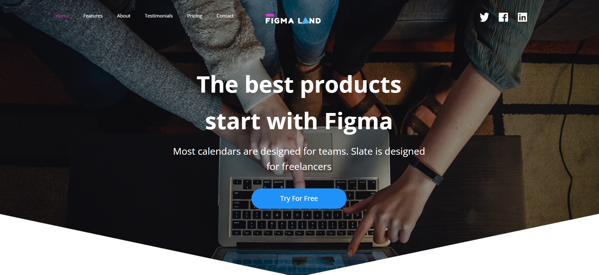
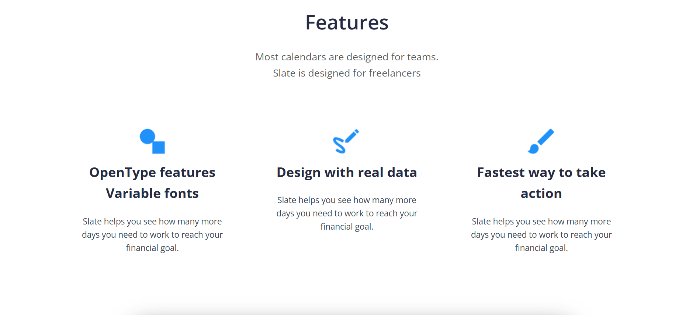
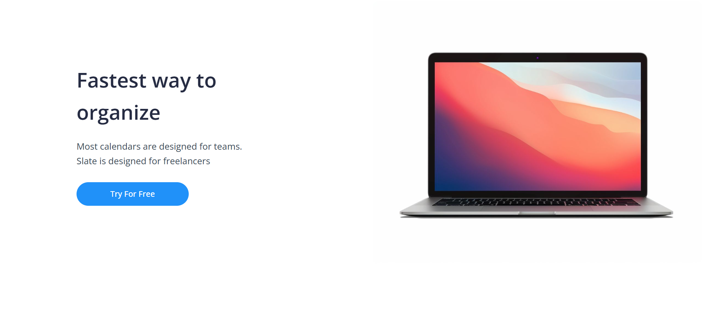
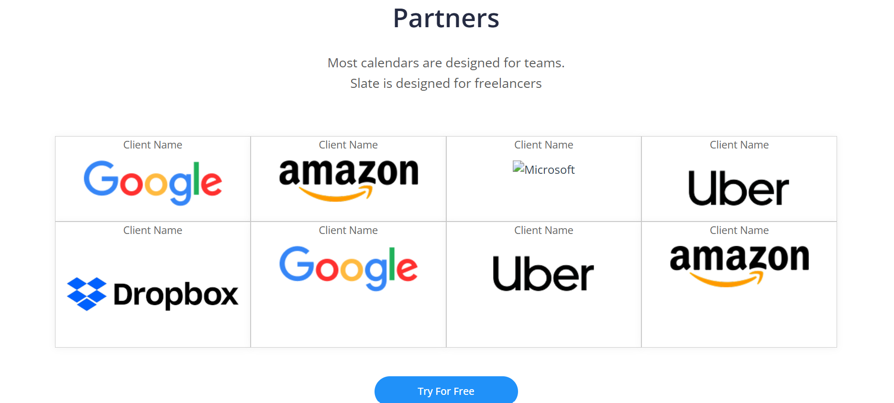
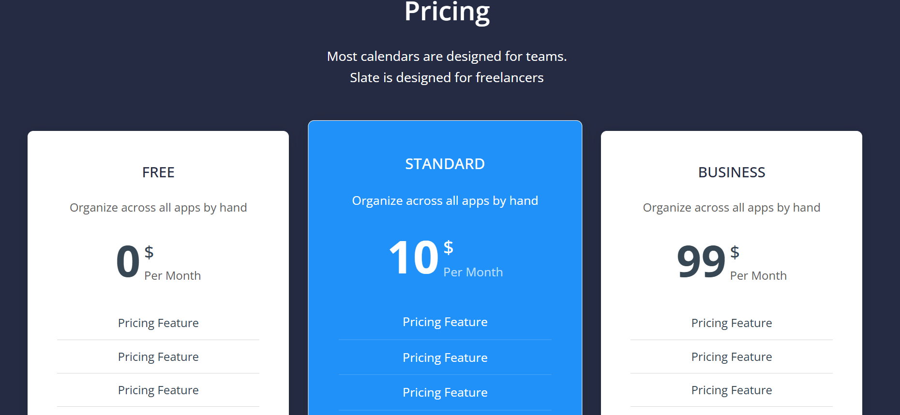
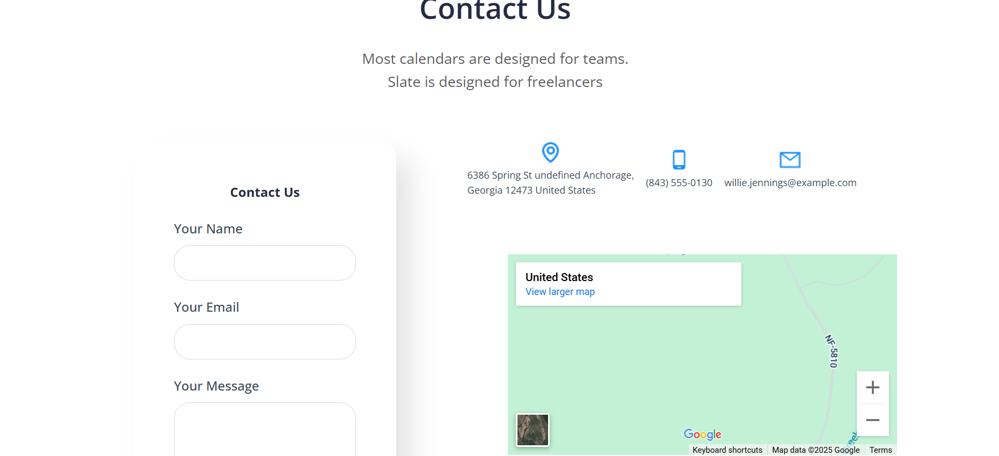
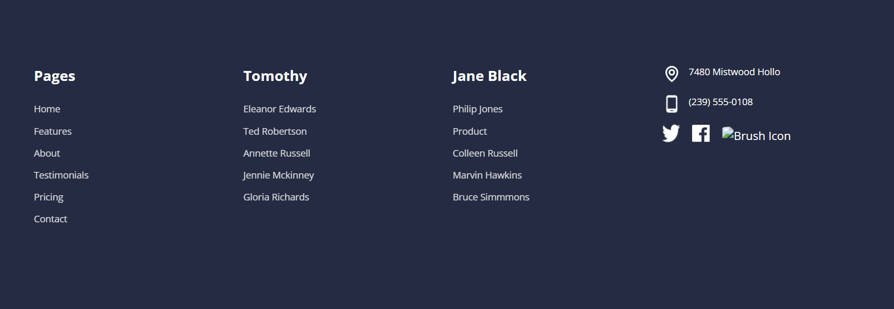

# 🚀 Modern Landing Page

A sleek and responsive landing page designed with HTML, CSS, and JavaScript. Built for promoting products, services, or any web-based startup. Includes interactive components like a modal, video player, testimonial slider, and responsive navbar.

---

## 🔗 Live Demo

 👉 [View Live](https://figma-landpage-clone.onrender.com) 

---

## 📸 Screenshots

### 🧭 Hero Section


### 📱 Features View


### 🎥 Promo Video


### 📱 Oransize View


### 📱 Subscribe View


### 📱 Partners View


### 💬 Testimonials


### 💬 Pricing View


### 📩 Contact Form & Modal


### 📱 Footer View


### 📱 Responsive View


---

## 🛠️ Built With

- HTML5
- CSS3 (Flexbox, Variables, Responsive Design)
- JavaScript (ES6)
- No frameworks used — fully vanilla JS

---

## 🚀 Getting Started Locally

1. Clone the repository
    ```bash
   git clone https://github.com/yourusername/landing-page.git
2. Navigate into the project folder
   ```bash
    cd landing-page
2. Open index.html in your browser
   ```bash
   open index.html
Or just double click on it....

## 🤝 Contributing

Contributions, issues, and feature requests are welcome! Feel free to fork and submit a pull request.


   

